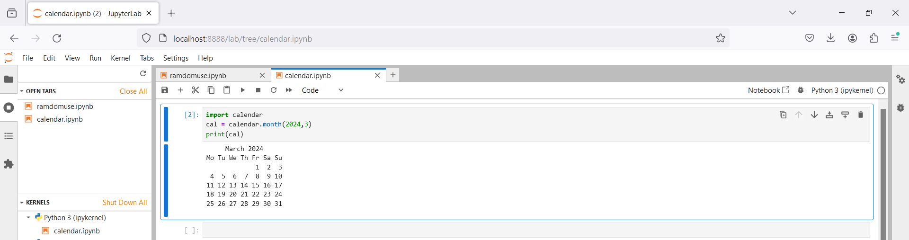
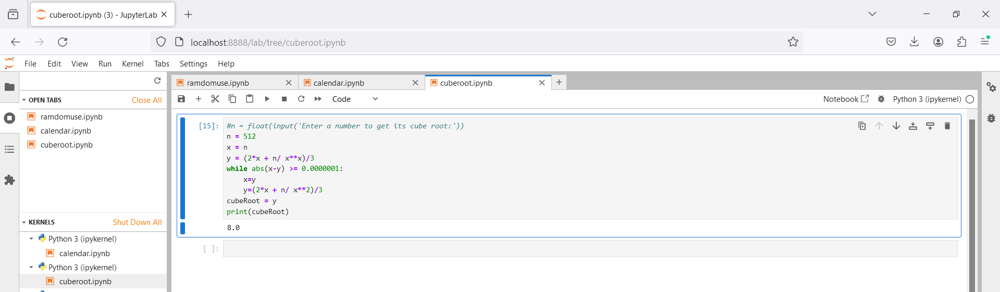
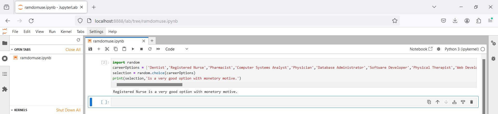

# Python 102
Jupyter Notebook collection with simple and reusable functions and scripts.

## Code Snippets, Easy to Recollect and Recreate

Calendar.month()

Cube Root

Functions of `random` module

## Contact Pointers
- **LinkedIn:** <https://www.linkedin.com/in/rishirajopenminds>
- **X:** <https://twitter.com/RishiRajDevOps>
- **Start Page:** <https://bio.link/rishiraj49de>
- **GitHub:** <https://github.com/rishiraj88>

## Credits and Gratitude
I thank all who have mentored, taught and guided me. Also, I appreciate who have supported my work with pair programming etc.
